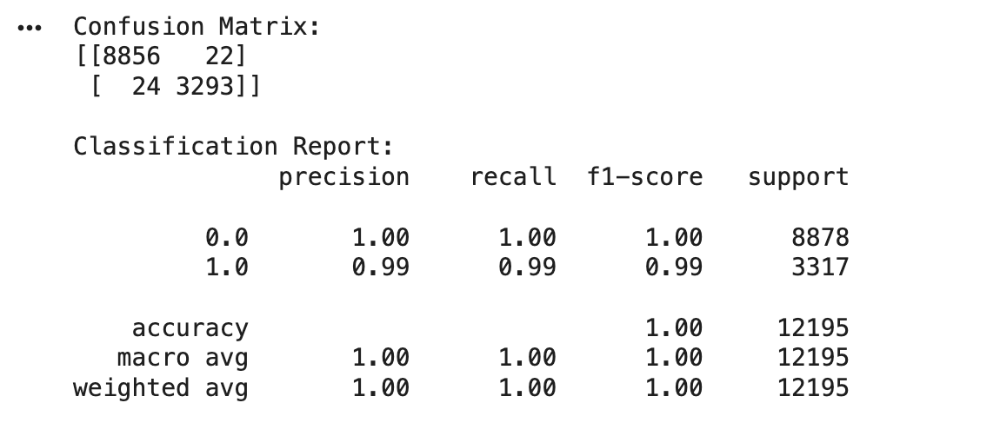

# Unsupervised Learning —— Echo Classification For Sea-ice and Lead
This project applies unsupervised learning to classify radar echo waveforms into leads and sea ice, using the notebook codings as a starting point. We will preprocess and represent echoes with dimensionality reduction and clustering, then compute the mean echo shape and standard deviation for each class to summarise their typical signatures. Finally, we will evaluate our classification against the ESA official labels using a confusion matrix (and standard metrics).
## Table of Contents
- [Unsupervised Learning introduction](https://github.com/Moon-Huangyh/AI4EO_Unsupervised_Learning_Methods/edit/main/README.md#table-of-contents)
  - [K-means Clustering](https://github.com/Moon-Huangyh/AI4EO_Unsupervised_Learning_Methods/edit/main/README.md#introduction-to-k-means-clustering)
  - [Gaussian Mixture Models (GMM)](https://github.com/Moon-Huangyh/AI4EO_Unsupervised_Learning_Methods/edit/main/README.md#gaussian-mixture-models-gmm)
- [Getting Started](https://github.com/Moon-Huangyh/AI4EO_Unsupervised_Learning_Methods/edit/main/README.md#getting-started)
- [Expected Results](https://github.com/Moon-Huangyh/AI4EO_Unsupervised_Learning_Methods/edit/main/README.md#expected-results-using-gmm-model-as-the-example)
- [Contact](https://github.com/Moon-Huangyh/AI4EO_Unsupervised_Learning_Methods/edit/main/README.md#contact)
- [Acknowledgement](https://github.com/Moon-Huangyh/AI4EO_Unsupervised_Learning_Methods/edit/main/README.md#acknowledgement)

## Unsupervised Learning introduction

## Introduction to K-means Clustering
K-means clustering is a type of unsupervised learning algorithm used for partitioning a dataset into a set of k groups (or clusters), where k represents the number of groups pre-specified by the analyst. It classifies the data points based on the similarity of the features of the data {cite}macqueen1967some. The basic idea is to define k centroids, one for each cluster, and then assign each data point to the nearest centroid, while keeping the centroids as small as possible.

### Why K-means for Clustering?
K-means clustering is particularly well-suited for applications where:
- **The structure of the data is not known beforehand:** K-means doesn’t require any prior knowledge about the data distribution or structure, making it ideal for exploratory data analysis.
- **Simplicity and scalability:** The algorithm is straightforward to implement and can scale to large datasets relatively easily.

### Key Components of K-means
- **Choosing K:** The number of clusters (k) is a parameter that needs to be specified before applying the algorithm.
- **Centroids Initialization:** The initial placement of the centroids can affect the final results.
- **Assignment Step:** Each data point is assigned to its nearest centroid, based on the squared Euclidean distance.
- **Update Step:** The centroids are recomputed as the center of all the data points assigned to the respective cluster.
### The Iterative Process of K-means
The assignment and update steps are repeated iteratively until the centroids no longer move significantly, meaning the within-cluster variation is minimised. This iterative process ensures that the algorithm converges to a result, which might be a local optimum.

### Advantages of K-means
- **Efficiency:** K-means is computationally efficient.
- **Ease of interpretation:** The results of k-means clustering are easy to understand and interpret.

## Gaussian Mixture Models (GMM)
Gaussian Mixture Models (GMM) are a probabilistic model for representing normally distributed subpopulations within an overall population. The model assumes that the data is generated from a mixture of several Gaussian distributions, each with its own mean and variance {cite}reynolds2009gaussian, mclachlan2004finite. GMMs are widely used for clustering and density estimation, as they provide a method for representing complex distributions through the combination of simpler ones.

### Why Gaussian Mixture Models for Clustering?
Gaussian Mixture Models are particularly powerful in scenarios where:
- **Soft clustering is needed:** Unlike K-means, GMM provides the probability of each data point belonging to each cluster, offering a soft classification and understanding of the uncertainties in our data.
- **Flexibility in cluster covariance:** GMM allows for clusters to have different sizes and different shapes, making it more flexible to capture the true variance in the data.

### Key Components of GMM
- **Number of Components (Gaussians):** Similar to K in K-means, the number of Gaussians (components) is a parameter that needs to be set.
- **Expectation-Maximization (EM) Algorithm:** GMMs use the EM algorithm for fitting, iteratively improving the likelihood of the data given the model.
- **Covariance Type:** The shape, size, and orientation of the clusters are determined by the covariance type of the Gaussians (e.g., spherical, diagonal, tied, or full covariance).

### The EM Algorithm in GMM
The Expectation-Maximization (EM) algorithm is a two-step process:
- **Expectation Step (E-step):** Calculate the probability that each data point belongs to each cluster.
- **Maximization Step (M-step):** Update the parameters of the Gaussians (mean, covariance, and mixing coefficient) to maximize the likelihood of the data given these assignments.
This process is repeated until convergence, meaning the parameters do not significantly change from one iteration to the next.

### Advantages of GMM
- **Soft Clustering:** Provides a probabilistic framework for soft clustering, giving more information about the uncertainties in the data assignments.
- **Cluster Shape Flexibility:** Can adapt to ellipsoidal cluster shapes, thanks to the flexible covariance structure.

## Getting Started
1. Open Notebook\
   Open the [notebook](Chapter1_Unsupervised_Learning_Methods.ipynb) through **Google Colab**. It is a free, browser-based Jupyter environment that lets you run Python notebooks with no local setup and easy access to Google Drive
2. Mount Google Drive\
   Use the codes below to mount your google drive to your notebook, so that it can access all your resources.
   ```
   from google.colab import drive
   drive.mount('/content/drive')
   ```
3. Preinstallation\
   The following codes are required to be run to install the packages needed for this project.
   ```
   pip install rasterio
   pip install netCDF4
   ```
4. Implementation\
   Running the codes in the notebook to get the clustering results of [K-means Clustering](https://github.com/Moon-Huangyh/AI4EO_Unsupervised_Learning_Methods/edit/main/README.md#introduction-to-k-means-clustering) and [Gaussian Mixture Models (GMM)](https://github.com/Moon-Huangyh/AI4EO_Unsupervised_Learning_Methods/edit/main/README.md#gaussian-mixture-models-gmm).

## Expected results (Using GMM model as the example)
**1. This cell plots every cleaned echo waveform on the same axes**
```
x = np.stack([np.arange(1,waves_cleaned.shape[1]+1)]*waves_cleaned.shape[0])
plt.plot(x,waves_cleaned)  # plot of all the echos
plt.show()
```


**2. Plotting echos for the lead cluster**
```
x = np.stack([np.arange(1,waves_cleaned[clusters_gmm==1].shape[1]+1)]*waves_cleaned[clusters_gmm==1].shape[0])
plt.plot(x,waves_cleaned[clusters_gmm==1])  # plot of all the echos
plt.show()
```


**3. Plotting echos for the sea ice cluster**
```
x = np.stack([np.arange(1,waves_cleaned[clusters_gmm==0].shape[1]+1)]*waves_cleaned[clusters_gmm==0].shape[0])
plt.plot(x,waves_cleaned[clusters_gmm==0])  # plot of all the echos
plt.show()
```


**4. Plotting the average echo waveform shape for each GMM cluster (one treated as “ice”, the other as “lead”), with the shaded band indicating ±1 standard deviation across all echoes assigned to that class.**
```
# mean and standard deviation for all echoes
mean_ice = np.mean(waves_cleaned[clusters_gmm==0],axis=0)
std_ice = np.std(waves_cleaned[clusters_gmm==0], axis=0)

plt.plot(mean_ice, label='ice')
plt.fill_between(range(len(mean_ice)), mean_ice - std_ice, mean_ice + std_ice, alpha=0.3)


mean_lead = np.mean(waves_cleaned[clusters_gmm==1],axis=0)
std_lead = np.std(waves_cleaned[clusters_gmm==1], axis=0)

plt.plot(mean_lead, label='lead')
plt.fill_between(range(len(mean_lead)), mean_lead - std_lead, mean_lead + std_lead, alpha=0.3)

plt.title('Plot of mean and standard deviation for each class')
plt.legend()
```


**5. The generated figure demonstrates whether our alignment step actually improves waveform registration**
```
# ============================================================
# Aggregate alignment comparison
# ============================================================

fig, axes = plt.subplots(2, 2, figsize=(15, 10))
n_img = min(1000, len(waves_norm))

# --- Top left: original waveform image ---
ax = axes[0, 0]
im = ax.imshow(waves_norm[:n_img].T, origin='lower', aspect='auto',
               cmap='viridis', vmin=0, vmax=1)
ax.set_title('Original Waveforms')
ax.set_xlabel('Waveform Index')
ax.set_ylabel('Range Bin')
plt.colorbar(im, ax=ax, label='Normalised Power')

# --- Top right: aligned waveform image ---
ax = axes[0, 1]
im = ax.imshow(waves_aligned[:n_img].T, origin='lower', aspect='auto',
               cmap='viridis', vmin=0, vmax=1)
ax.set_title('Aligned Waveforms')
ax.set_xlabel('Waveform Index')
ax.set_ylabel('Range Bin')
plt.colorbar(im, ax=ax, label='Normalised Power')

# --- Bottom left: peak position histograms ---
ax = axes[1, 0]
ax.hist(peaks_before, bins=50, alpha=0.6, color='steelblue',
        label=f'Before ($\sigma$={np.std(peaks_before):.1f} bins)')
ax.hist(peaks_after,  bins=50, alpha=0.6, color='tomato',
        label=f'After ($\sigma$={np.std(peaks_after):.1f} bins)')
ax.set_xlabel('Peak Bin')
ax.set_ylabel('Count')
ax.set_title('Peak Position Distribution')
ax.legend()

# --- Bottom right: mean waveform by class, before vs after ---
ax = axes[1, 1]
xr = np.arange(n_bins)
for cls, name, color in [(0, 'Sea Ice', 'green'), (1, 'Lead', 'blue')]:
    cls_mask = clusters_gmm == cls
    if np.sum(cls_mask) < 5:
        continue
    ax.plot(xr, np.nanmean(waves_norm[cls_mask], axis=0),
            color=color, linestyle='-', alpha=0.5, label=f'{name} (original)')
    ax.plot(xr, np.nanmean(waves_aligned[cls_mask], axis=0),
            color=color, linestyle='--', linewidth=2, label=f'{name} (aligned)')
ax.set_xlabel('Range Bin')
ax.set_ylabel('Normalised Power')
ax.set_title('Mean Waveform by Class')
ax.legend(fontsize=8)
ax.grid(True, alpha=0.3)

plt.suptitle('Alignment Effect: Aggregate Comparison', fontsize=14)
plt.tight_layout()
plt.show()
```


**6. Evaluating how well your GMM clustering matches the ESA official classes**
```
flag_cleaned_modified = flag_cleaned - 1

from sklearn.metrics import confusion_matrix, classification_report

true_labels = flag_cleaned_modified   # true labels from the ESA dataset
predicted_gmm = clusters_gmm          # predicted labels from GMM method

# Compute confusion matrix
conf_matrix = confusion_matrix(true_labels, predicted_gmm)

# Print confusion matrix
print("Confusion Matrix:")
print(conf_matrix)

# Compute classification report
class_report = classification_report(true_labels, predicted_gmm)

# Print classification report
print("\nClassification Report:")
print(class_report)
```


## Contact
Moon Huang: zcfbhua@ucl.ac.uk
Personal: moonhuangyh@gmail.com

## Acknowledgement
Thanks for the guidance from Dr. Michel Tsamados and the demonstrators.
